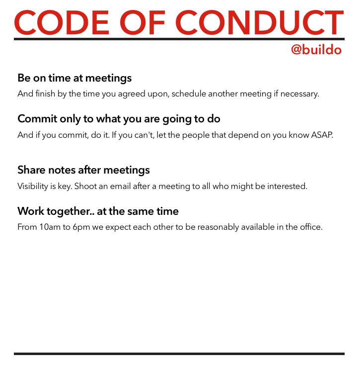

# Code of Conduct

We have a very succinct code of conduct.

For the curious, here's the original document we used to discuss them.

https://paper.dropbox.com/doc/code-of-conduct-VnfduvHgNmOY0v3xqfnNC

As you can see, there were many points discussed, but we picked the top 4 so that we can really commit on them. This is exactly in the spirit of the second point of the CoC itself.

Recursion is a bitch.

