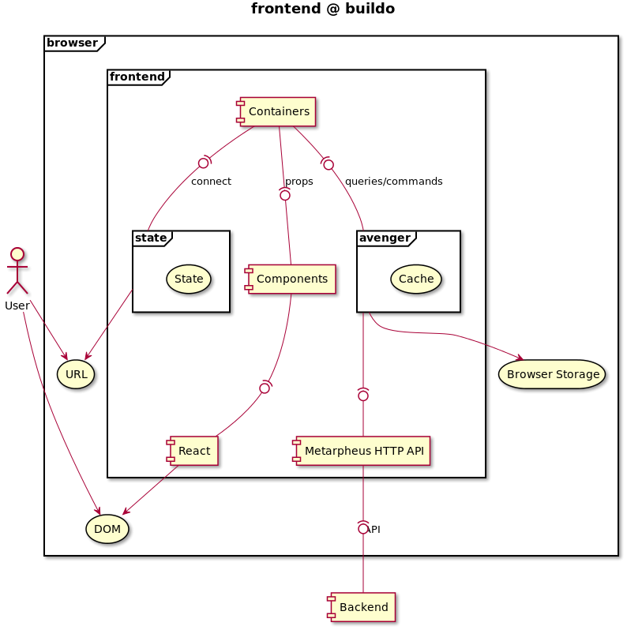

# Architecture overview

Here's an high level diagram describing what's the standard architecture for a React web app at buildo.
A couple things to note:
- This diagram represents "dependencies" among different high-level components of an app. It doesn't, for instance, represent "data-flow".
- Some of the boxes depicted here might not make 100% sense to you at a first glance. We warmly recommend to come back here after having completed the [Tutorial](../5.tutorial.md).

