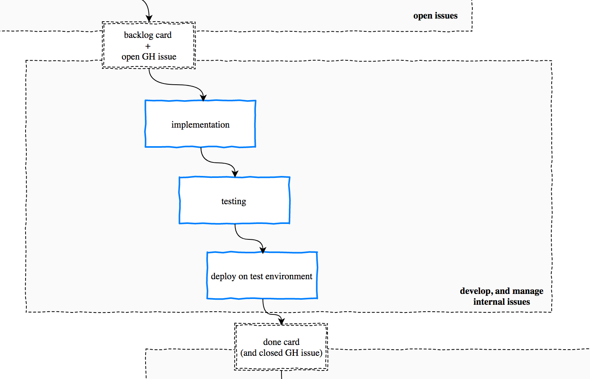

# Develop

The full development workflow is under [Development workflow](../workflow/README.md).

Here we only discuss how issues enter and exit the development workflow.

## From backlog to done

### Choose an issue

Everything starts from an open issue associated to a backlog card. Open issues should be only those issues that are "in development". Things that will be developed in the future should stay in Trello, not GitHub.

If you work with sprints (milestones), the open issues should mostly be the current sprint.

### Implement, test and deploy

This is the development flow. Only two things must be highlighed from a PM perspective:

* **testing** is tracked and ensured via test plans: **the first and most important Q.A. step is on developers**.
  * make sure the test plan template is good for your project, and customize it if necessary!
* **deploy** on the test environment is essential for PMs and customers to test: it's mandatory and should be automated.

## I'm a Dev: what if I need to open a new issue? Should I go to Trello?

The guidelines is simple:

- if it's **in focus**, meaning you are going to work on it right away or very soon (same day), open in GitHub
- otherwise, if **not in focus**, open in Trello

### A note for PMs...

At times developers open issues in GitHub and don't work on them right away, generating backlog that needs prioritization. These issues are visible in the list "github PM buffer" in Trello, the PM can then:

- ask the developer if they want to work on it right now, and move the card to the focus column
- close the issue on GitHub, and move the card upstream

