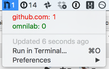

# bitbar plugins

[bitbar](https://github.com/matryer/bitbar) is a lovely OS X utility that lets you show the output of any script/program in the OS X menu bar.

At buildo we developed a few bitbar scripts to help keeping the status of your "GitHub backlog" always visibile.

We're going to discuss them briefly here. You can refer to their readmes for installation and other details.

## [pull requests](https://github.com/buildo/bitbar-plugins/tree/master/pr-to-review)

We care a lot about code reviews, and it's important to perform them regularly in order to avoid blocking other teammates.

The first script displays the number of pull requests assigned to you, so that you don't forget about them.

## [issues](https://github.com/buildo/bitbar-plugins/tree/master/assigned-issues)

In observance of our code of conduct, it's important to commit only to what you're going to do. For this reason, an assigned issue should be something you're currently working on. This second script shows the issues assigned to you.

## [everything](https://github.com/francescogior/github-bitbar-counter)

Why limiting yourself to issues and pull requests?

With this last script you can freely define an arbitrary set of GitHub queries whose result will appear in your menu bar.
