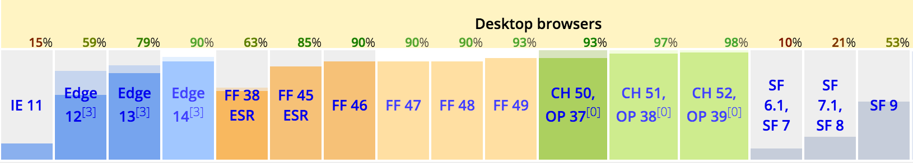

# JavaScript at buildo

This section should be an overview of how we use (or limit/tame/`<put your preferred against-js verb here>`) JavaScript per-se as a language at buildo.
Let's start by defining exactly which specification of the language we are talking about.

## ESWat?
If you're new to the ES6 specification.. I'm sorry.
More seriously, this [introductory talk slides](https://speakerdeck.com/gabro/es2015-and-beyond) by @gabro should get you on track. For a more thorough review of new features and changes included in ES6, [ponyfoo.com](https://ponyfoo.com/articles/es6) is a good resource.

Now to a more practical point. We have a problem here:

*https://kangax.github.io/compat-table/es6/*

And node is not much better. We are getting there, but we still need a transpilation step.

Fortunately, [babel](https://github.com/babel/babel) comes to the rescue. Our typical build/bundling setup includes a `babel` transpilation step through [webpack](https://github.com/webpack/webpack). We discuss the technicalities of this in other sections, but [here](https://github.com/buildo/webseed/blob/master/webpack.base.babel.js) is an example configuration.

Given that this transpilation step is required, why limit to ES6?
`ESx` is a moving standard, especially these days: [ES2016](http://www.2ality.com/2016/01/ecmascript-2016.html), [ES2017](http://www.2ality.com/2016/02/ecmascript-2017.html).[^1]

We actively use of some almost-standard features (e.g. [async-functions](https://github.com/tc39/ecmascript-asyncawait)), and a few highly tentative ones (e.g. [object-rest-spread](https://github.com/sebmarkbage/ecmascript-rest-spread) and [decorators](https://github.com/wycats/javascript-decorators/blob/master/README.md)), thanks to babel and various plugin supporting them.

Is this a good idea? Why not, as long as the following conditions are met:
- the feature improves our code. It makes it more readable, concise, or elegant.
- there's an easy escape procedure[^2]. If and when the proposal does not make it to a standard, and babel or other tools stop supporting it, it should be easy to "transpile back" (i.e. removing all usages in our codebase, possibly in an automated way. Hint: [jscodeshift](https://github.com/facebook/jscodeshift))
- it is widely supported across different tools (mainly babel, eslint and editor code highlight), and the implementation is sufficiently stable (e.g. we won't start using a new fantasy-js feature implemented the night before by some drunk wannabe developer. Or at least we'll try not to)

## Linting and Code conventions

We try to standardize as much as possible the code we write with two main objectives in mind:
- Someone reading the code later on should be able to *easily* understand what a given piece of code does. That person could be you. Respect your future self
- Some common pitfalls/potential bugs can be avoided with a certain style of code. For instance, bugs derived from mutating local state can be partially removed from day 0 if we allow only `const` and no `let/var`

### ESLint

The first objective requires the developer to come up with code that is as explicit and clear as possible, and the reviewer of a PR to enforce it at review time. For both points though, we can delegate much of the grunt work to a linter. Put it more clearly:

There are some things an automated tool can't buy you. For everything else, there's [ESLint](https://github.com/eslint/eslint).

[buildo/eslint-config](https://github.com/buildo/eslint-config) is a meticulously hand-crafted ESLint configuration that we use on all our projects. Except a few exceptions (you can always turn on/off rules for specific projects), it should exactly allow what we want and prevent much of the unwanted.

It contains rules for JavaScript, rules specific to react, and some additional rules provided by our own plugins like [no-loops](https://github.com/buildo/eslint-plugin-no-loops) and [no-copy-paste](https://github.com/buildo/eslint-plugin-no-copy-paste-default-export).

If you think the [airbnb styleguide](https://github.com/airbnb/javascript) is too nazi, think again. Come back after having tried [our own](https://github.com/buildo/eslint-config).

In addition, we also have a WIP [styleguide book](https://buildo.gitbooks.io/js-style-guide/content/guide/01.Types.html), in the same spirit of the `airbnb` one. This should serve as an explanation of the "whys" behind the rules in our eslint config, plus adding more shared code conventions in a descriptive form.

## Typing

As the informed reader might already know, JS doesn't offer us much in terms of types.

Taking for granted that the specification might never evolve to a better typed language (for backward compatibility and other valid reasons), the community is moving producing support and tooling for types in three main directions, which we'll explore briefly.
 
- **compile-to-js languages**: on the bright side, JS is an easy and profitable compilation target. There are many options around these days, basically every language on earth has some support for compilation to JS (examples are [Scala.js](https://github.com/scala-js/scala-js), [purescript](https://github.com/purescript/purescript) and [ClojureScript](https://github.com/clojure/clojurescript)). However, in terms of adoption of the JS community, we currently have a clear winner which is [TypeScript](https://github.com/Microsoft/TypeScript). The idea here is to have a superset of JS that stays very close to the original language, adding type annotations and a few keywords, but adds **static** type checking before the output of any valid JS code. In addition, the TypeScript compiler supports the latest ESWhatever features, and takes care of producing cross compatible bundles for you (so in a typical scenario you would also partially replace webpack/babel with TypeScript).
- **external *static* tools**: AKA [flow](https://github.com/facebook/flow) (I'm not aware of any other comparable tool in this category). [Flow](https://github.com/facebook/flow) runs alongside your dev/build pipeline, understands a superset of JS (various type annotations), adds type inference (so even for non-annotated sources), and does its magic (reports compile-time errors).
- **JS library**: As the even-more-informed reader might have guessed, in this world you loose the ability to do any static type checking, you're limited[^3] to the dynamic world.

### runtime type checks and a path forward

We are currently relying on the third option only, and we're doing so via [tcomb](https://github.com/gcanti/tcomb) and its ecosystem ([tcomb-react](https://github.com/gcanti/tcomb-react), [babel-plugin-tcomb](https://github.com/gcanti/babel-plugin-tcomb)).

From [tcomb README](https://github.com/gcanti/tcomb/blob/master/README.md),

> tcomb is a library for Node.js and the browser which allows you to check the types of JavaScript values at runtime with a simple and concise syntax

You can find a much more comprehensive description on github, especially in the [GUIDE](https://github.com/gcanti/tcomb/blob/master/GUIDE.md).

[tcomb-react](https://github.com/gcanti/tcomb-react) is the tcomb integration for react, it basically provides `@props`, a (arguable, but in our option *better*) replacement for react own `PropType` definitions.

[babel-plugin-tcomb](https://github.com/gcanti/babel-plugin-tcomb) is a babel plugin that allows the developer to declare runtime type checks as type annotations, using the `tcomb` syntax. Basically the plugin does some code transformations that transform the annotations into actual runtime code. It writes the assertions for your type declarations.

`babel-plugin-tcomb` is particularly interesting as a first step in the static type checking direction: provided a way to make e.g. flow understand our tcomb annotations[^4] (or viceversa, translating the annotations to flow and do the opposite), we should be able to get the best of both worlds.[^5]

[^1]: Here's the full list of currently active proposals: https://github.com/tc39/ecma262/blob/master/README.md
[^2]: For instance, we use `decorators` a lot. If we ever want to remove them, it should be a relatively easy static transformation on our codebase, given that they are not much more than a different syntax for 1-ary functions application.
[^3]: In terms of power and expressiveness this is not an actual limitation (the contrary is usually true). In terms of confidence though, it is sort of a bummer: you can't prove things without actually running the code. You are forced to explicitly stimulate any interesting `code-path X state`, which is basically impossible. The hard truth is that, in the real ("dynamic languages") world, this happens (more often than you might think) directly in production :(
[^4]: Imaginary work at the moment. Sounds feasible though, at least where the two worlds (static and runtime) can share the same semantics.
[^5]: Some checks will always remain dynamic/runtime. For instance, think about the "API boundary": a client must parse and then typecheck a string/JSON value. A static tool doesn't add any guarantee there, type checking, and how to continue/recover when things go wrong, must be handled at application/runtime level.