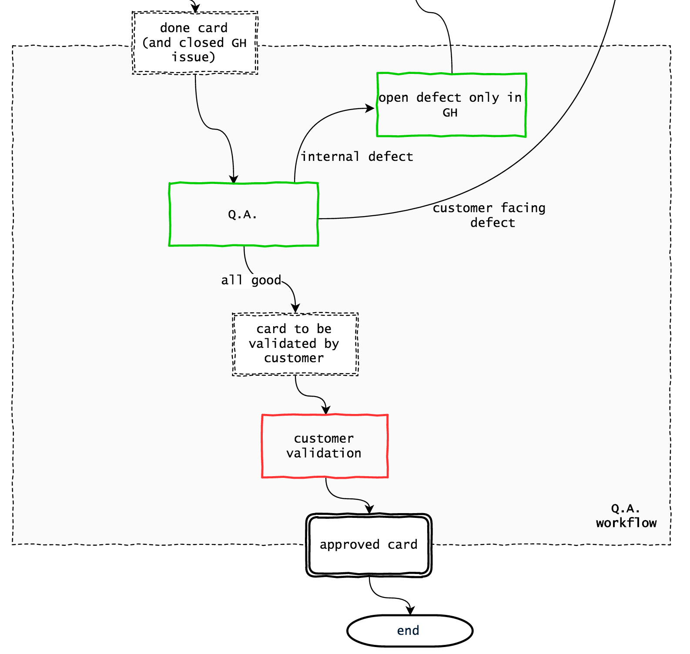

# Q.A. workflow

Q.A. in buildo is done in 3 ordered steps:
1. **developer testing** verify that issue requirements are met, and that no regression has been caused
2. **PM Q.A.** second verification on issue requirements from the PM perspective
3. **customer validation** verification on customer requirements as defined in Trello

Developer testing is explained in the [Pull Requests](../workflow/3.pull-requests.md) chapter.

## PM Q.A.

In this step, the PM moves cards from the "done" column to the "to be reviewed by client" column. While `done` is mandatory and should not change name, client review columns are flexible and should be adapted to the specific product flow.

The function of PM Q.A. is to assure that requirements have been met, and that nothing was lost in translation.

Even if the development team always implements as required, this step is useful for the PM to verify that requirements were complete and consistent.

It's not responsibility of the PM to find regression bugs or other implementation bugs, and developers should not rely too much on this step.

### What to do when a defect is found?

If the product does not have an internal defect flow, the PM must track all defects via PRISMA. In the PRISMA flow, this is the arrow saying "customer facing defect". All defects are also visible to the customer.

1. [optional] log the defect in the "PM defect buffer" (see [PRISMA flow](prisma_flow.md)), which is a column in Trello.
2. take the defect and open it as a backlog card following the usual [Customer requests workflow](customer_requests_workflow.md). If you have a defect buffer, this is done in batch, typically with your dev lead while preparing the next milestone.

If you can use the internal defect flow, you can also open the defect directly in GitHub and stop tracking it. It will be managed by the dev team, as explained in the [dev workflow](dev_workflow.md) section.

## Customer validation

In the last step, buildo believes that no bugs exist and all business requirements are met. We only await a final validation from the customer, useful for:
- **contractual reasons** this serves as formal acceptance of the implemented task
- **customer awareness** customers typically request features but often don't check them out for real. It's very beneficial for the product if the customer understands every aspect involved.
- **final requirements verification** at times the implemented feature is not up to expectations, either because buildo failed or because the customer expressed a partial request without knowing. This last step should avoid crippled features to live too long.