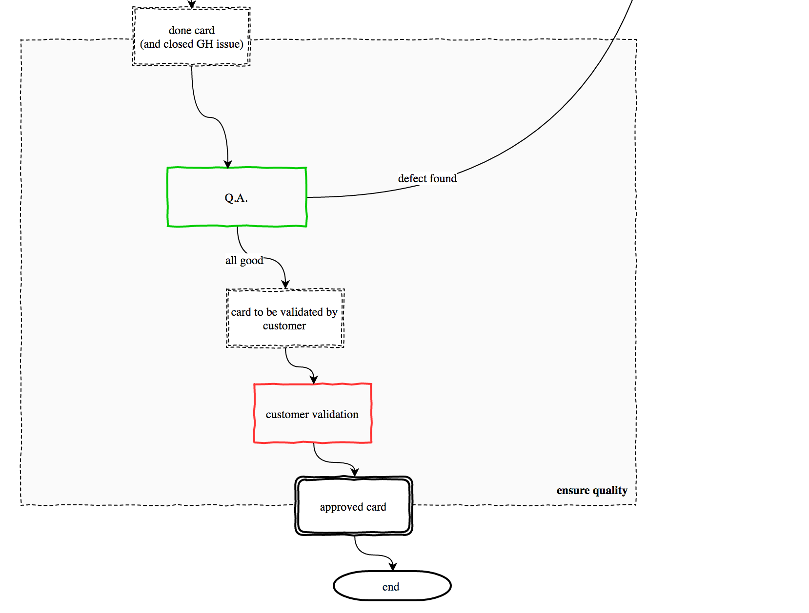

# Ensure quality


Q.A. in buildo is done in 3 ordered steps:
1. **developer testing** verify that issue requirements are met, and that no regression has been caused
2. **PM Q.A.** second verification on issue requirements from the PM perspective
3. **customer validation** final validation by the customer

Developer testing is explained in the [Pull Requests](../workflow/3.pull-requests.md) chapter.

## PM Q.A.

In this step, the PM moves cards from the "done" column to the "to be reviewed by client" column. While `done` is mandatory and should not change name, client review columns are flexible and should be adapted to the specific product flow.

The function of PM Q.A. is to ensure that requirements have been met, and that nothing was lost in translation.

Even if the development team always implements as required, this step is useful for the PM to verify that requirements were complete and consistent, and to grow their knowledge about the product itself.

It's not responsibility of the PM to find regression bugs or other implementation bugs, and developers should not rely too much on this step.

## Customer validation

In the last step, buildo believes that no bugs exist and all business requirements are met. We only await a final validation from the customer, useful for:

* **contractual reasons** this serves as formal acceptance of the implemented task
* **customer awareness** customers typically request features but often don't check them out for real. It's very beneficial for the product if the customer understands every aspect involved.
* **final requirements verification** at times the implemented feature is not up to expectations, either because buildo failed or because the customer expressed a partial request without knowing. This last step should avoid crippled features to live too long.

## What to do when a defect is found

If you are working with a macro issue, simply add a new sub-issue to track the defect. The macro issue will be opened again, and it will move back to the backlog column.

If, on the other hand, you are working with a simple issue, it's a good practice to transform the issue in a macro and then create a sub-issue for the defect.

To do this automatically, simply run this command:

```
curl \
-X POST \
-H "x-extension-event: extension-issue-with-card-to-sub-issue" \
-H "Content-Type: application/json" \
-d '{"repoFullName": "{{ORG/REPO}}", "topic": "{{TOPIC}}", "issueNumber": {{ISSUE_NUMBER}}}' \
https://prisma.our.buildo.io/extension
```
For example, `{{ORG/REPO}}` can be `buildo/prisma`. The topic should be a short description of the feature, which will be used as topic for the macro issue.

