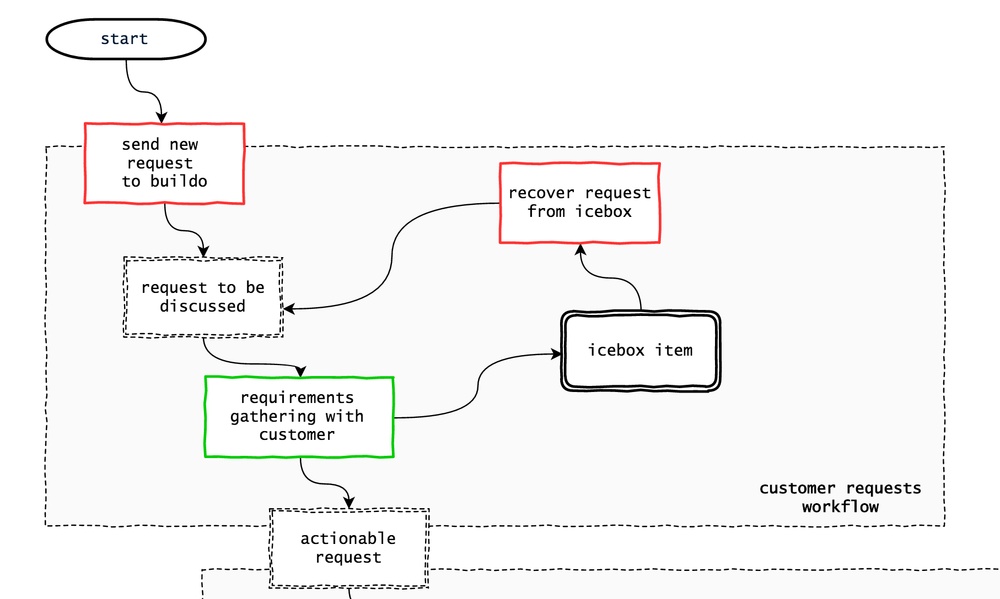

# Customer requests workflow

Every request must be tracked in PRISMA. If possible, customers should be trained to submit new requests directly in the Trello board, tipically in a column called `(r) requests to be discussed`. If not possible, the PM will manually add requests here as they come.

The `(r) ` at the beginning of a column name tells PRISMA to treat that column as a request column. This adds a feature to let you open a GitHub issue directly from the card maintaining traceability.

Typically we have 4 requests columns:

- `(r) icebox` requests that are on hold, buildo does not work on these
- `(r) requests to be discussed` requests that need to be refined and transformed into actionable requests
- `(r) bug reports` bug reports from the customer are just a special kind of request to be discussed, but it's useful to keep them apart
- `(r) actionable requests` requests ready to go to the next step (backlog grooming)

The PM is responsible for transforming all requests (except those in icebox) into actionable requests. We refer to this process as **requirements gathering**.

## Requirements gathering guidelines

buildo is not a mere executor. **buildo helps customers in defining exactly what they want**.

This process, helping a customer defining their wish, is requirements gathering.

Our objective is to shape a customer wish into a set of requirements that are:

- **effective**: fully respond to the *real* customer need
- **efficient**: our mission is not to charge extra hours whenever possible
- **actionable**: complete, consistent, and with a sufficient level of details for buildo to execute

It's a 2 step process:
1. understand the real business need
2. design a solution

We won't go into detail for the second step, as we don't have yet some magic guideline to help you do a good and efficient design.

On the contrary, understanding the real business need might seem trivial, but requires practice and can have devastating results if not taken seriously.

### The XY problem

The most authoritative definition of the [XY problem](http://xyproblem.info/) is, as usual, in stack exchange:

> The XY problem is asking about your attempted solution rather than your actual problem.

> That is, you are trying to solve problem X, and you think solution Y would work, but instead of asking about X when you run into trouble, you ask about Y.

You can find the full question and answers [here](http://meta.stackexchange.com/questions/66377/what-is-the-xy-problem), it's an interesting read.

We face this problem all the time with our customers. They have a problem, which we'll call **business need**, but they start talking about *a* solution. For example, they need to notify their user quickly when a specific event happen, but instead of explaining their business need, they start asking about a push notification system.

At times the solution is the perfect one, but in general it will be sub-optimal in terms of efficiency and effectiveness.

### Solutions to the XY problem
Just look for the most upvoted comment, of course:

The [5 Whys technique](https://en.wikipedia.org/wiki/5_Whys) is typically used to find the root cause of a problem in a chain of cause-effect.

We can follow a similar approach, asking our customer **why** they need a push notification system. And when they tell you "to let users know this happened", ask **why** they need to know. And when you discover that they need to know so that they can react right away, ask **why** they need to react so quickly. After only 3 whys, you might discover that a reaction time of 1 week is perfectly fine. 

And you can simply add an email to the existing email notification module. Turns out the customer solution was inefficient.

Or maybe they want to add an additional field in a form, **why**? *Because we need that information.* **Why**? *Because from that information we get relevant metrics.* And you say.. *do you know how many people actually complete those extra fields? 5%*.

Ah.

Well, turns out we need to do something much more complex and costly to get that information. In this case, the customer solution was not effective.

