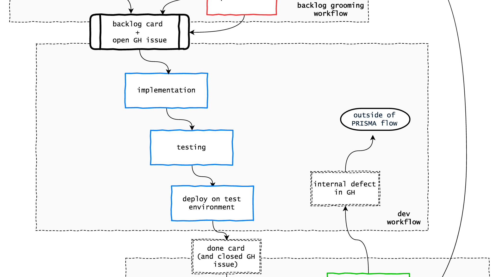

# Dev workflow

The full development workflow is under [Development workflow](../workflow/README.md).

Here we only discuss how issues enter and exit the development workflow, plus the internal defect flow in GitHub.

## From backlog to done

### Choose an issue

Everything starts from an open issue associated to a backlog card. The first thing is to find issues with high priority: those linked to the top cards in the backlog column.

To do this, we have 2 systems:
- **simple flow** PRISMA takes care of labeling the top 5 issues with priority labels, so that devs don't need to leave GitHub.
- **milestone flow** On more complex projects, the milestone flow requires a milestone to be defined with all the issues for the current iteration. Inside a milestone, issues are not prioritized. Developers only take issues from the current milestone.

The milestone flow works if there are sufficient resources on a product, typically for smaller products the simple flow is enough.

To help visualize the current milestone, you can use the [milestone overview tool](https://github.com/buildo/core/issues/201). It's a WIP, still under evaluation :)

### Implement, test and deploy

This is the development flow. Only two things must be highlighed from a PM perspective:
- **testing** is done via test plans: **the first and most important Q.A. step is on developers**.
- **deploy** on the test environment is essential for PMs and customers to test: it's mandatory and should be automated.

## Internal defect flow

In products with large teams, the PM might not able to track all issues and assure they get completed. In this case, we can use the (optional) internal defect flow.

1. **Developers can open issues in GitHub and let them stay there**
  - in the simple flow, developers can only open issues if they are going to close them soon after
2. **PMs can open issues for small defects in GitHub and not track them in Trello**
  - in the simple flow all defects must be tracked in Trello
3. **The dev lead must limit the total number of open internal issues**
  - in the simple flow typically there is no dev lead, all tracking is done by the PM

As a rule of thumb, an issue should be internal if it is:
- DX (developer experience)
- a minor refactor (does not impact greatly on dev planning)
- a minor defect filed by a developer
- a serious bug reported and solved by developers within a short time (hours, maximum a few days)