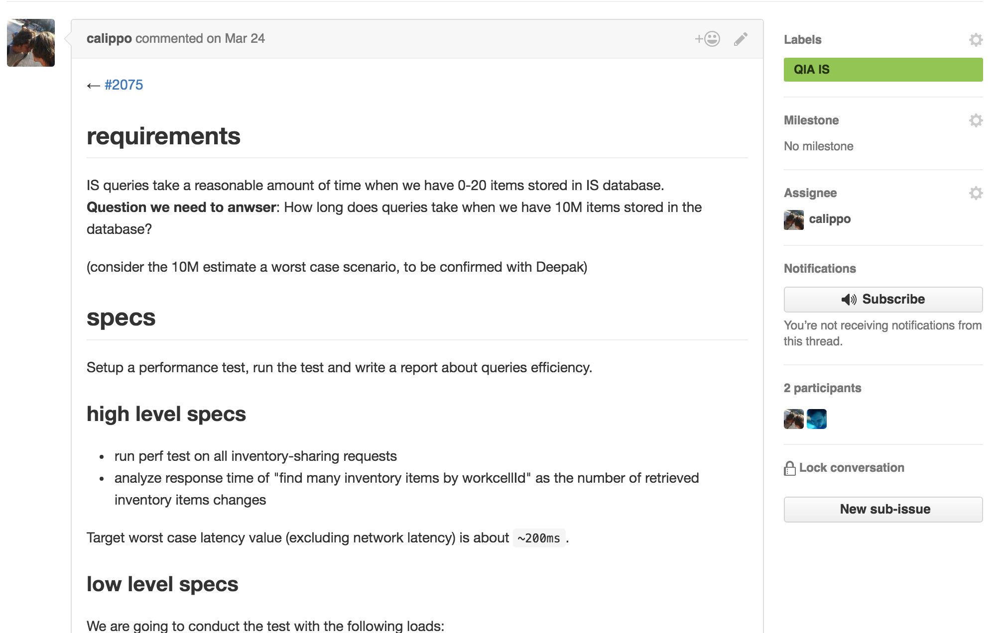

# Issues
An issue is where the discussion about a certain feature happens.

It contains all the necessary information for understanding the work that has to be done.

Issues can be of different kinds (feature, defect, bug, etc.) and each kind will have specific sections.

We won't get into specific details about these sections here. Such sections are pre-populated for you when using [workflow-pal](6.workflow-pal.md) and they have placeholders to guide you through the process. More on templates and workflow pal in future chapters.

We work in a dynamic environment, so templates are subject to changes as they adapt to our workflow.

Don't expect them to be written in stone.

This also means that any constructive feedback is encouraged and welcome.

## Sub-issues
GitHub doesn't have the concept of sub-issue.

Nonetheless, we *really* wanted them, so - guess what - we rolled our own solution.

A sub-issue is useful for breaking down an issue into small and actionable issues.

When this happens, we refer to the original issue as `macro` (and apply the `macro` label to it).

A macro issue has a `sub-issues` section, under which are tracked the sub-issues.

A macro issue serves only as an aggregation point and it **can't have an associated PR**.

Development happens only on the sub-issues and the macro issue gets closed when all the sub-issues are completed.

Here's an example:

Sub-issues always have a pointer to their macro issue in their body. Here's an example:

> **A word of caution**
> 
> Nothing prevents a sub-issue to be a `macro` issue itself and it may make sense in some instance.
> However, having more than one level of sub-issue depth can quickly become cumbersome to manage.
> 
> As a rule of thumb, limit yourself to one sub-issue level. 

### how we actually do this
As you probably noticed, there's quite a bit of housekeeping required: labels, sections, list of sub-issues, parents backlinks.
The idea of doing it by hand is daunting, and as a matter of fact, we don't.

See the `New sub-issue` button in the screenshots above?
That comes from [workflow-pal](6.workflow-pal.md), our beloved chrome-extension. It works together with [nemobot](5.nemobot.md), our glorious GitHub bot and flying clownfish, to make your life easier and your workflow smoother.

We'll talk about them in the next chapters.