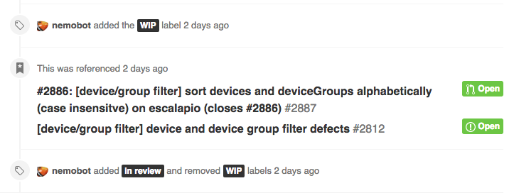
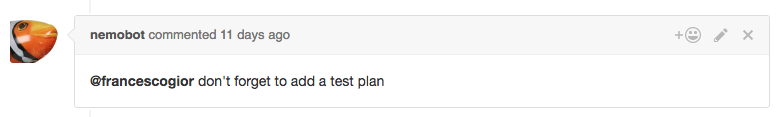

# nemobot

This is nemo, on its first day at buildo

Since then nemo has moved on, and evolved into its new form: [**nemobot**](https://github.com/buildo/nemobot).

nemo used to be a glorious flying fish.

nemobot is now a glorious flying fish with extensive GitHub capabilities.

## nemobot as github prettifier
Once upon a time, `nemobot` was actually called `github-prettifier`. The name is a bit more descriptive of its purpose.

`nemobot` is a bot (duh) that keeps GitHub consistent with our workflow.

Here's a *non-comprehensive* list of its "prettifyng" tasks:

- mark PRs without an assignee as `WIP`...
- ...and mark PRs with an assignee as `in review`

  
  
- do the same for the issues PRs refer to
  
  

- make sure every issue has a topic label

  
  
- make sure every PR has a test plan
 
  
  
- provide link for branch previews

  
  
- celebrate when we merge a PR!! 🎉
   
  
  
## nemobot as API
nemobot is also our master of keys for GitHub-related matters.

All our tools that interact with GitHub in some way refer to nemobot as their source of truth.

Examples of this are:

- `hophop`: it asks nemobot for the PR template when it creates a new PR
- `github-workflow-pal`: it asks nemobot for the custom issues templates
- `drone`: drone is our CI server and it asks nemobot to post the "branch preview" comments (see above) whenever appropriate